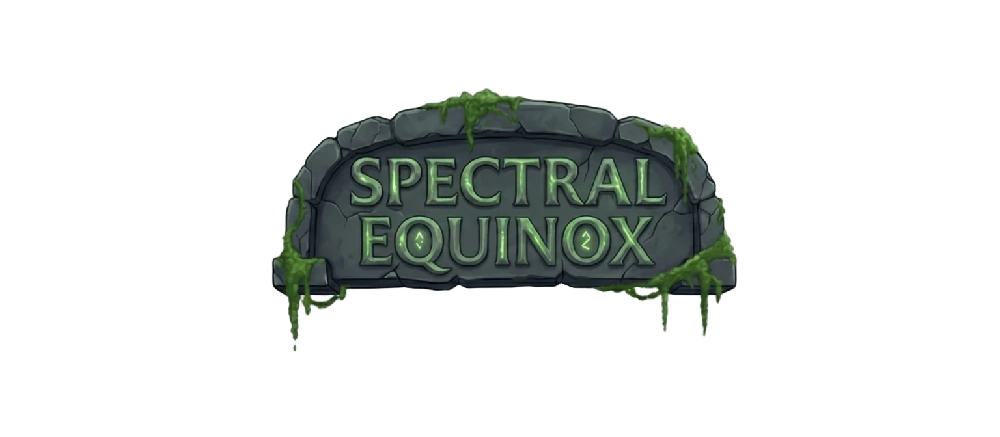
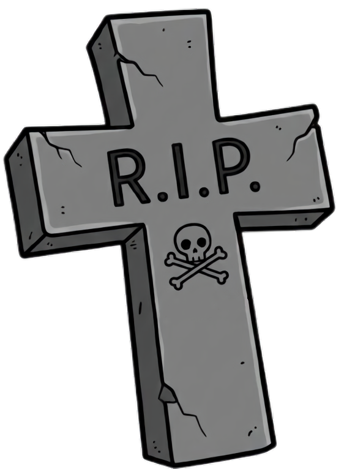
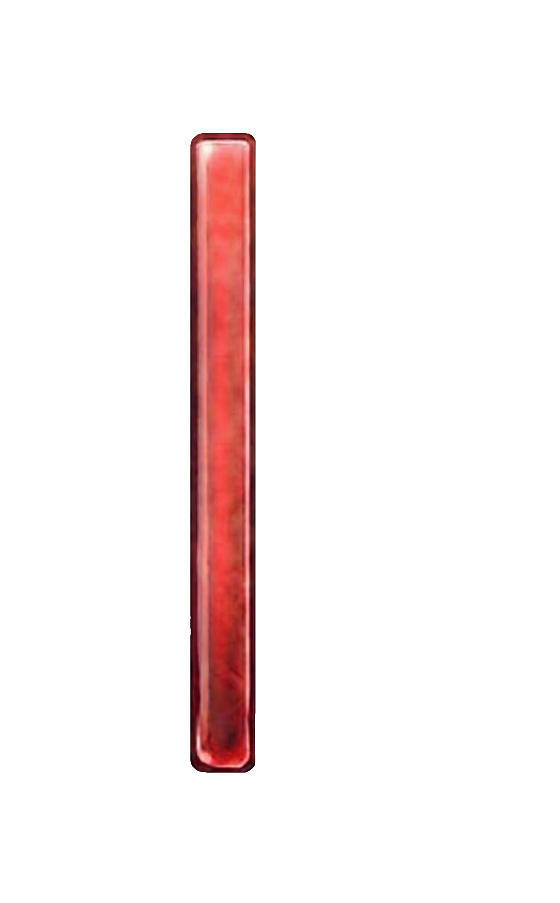

# Spectral Equinox 🎮



**Proyecto Unity — Asignatura Imagen Digital (ID)**

Un juego **cooperativo local de plataformas y puzles** para dos jugadores con roles asimétricos: **Vida (Luz)** y **Muerte (Sombra)**. Ambos deben colaborar combinando sus únicas habilidades para superar obstáculos, resolver puzles y completar tres niveles progresivos.

---

## 🎮 Características Principales

- ✅ **Cooperativo local 2 jugadores** con controles independientes
- ✅ **Mecánicas asimétricas**: Vida lanza proyectiles; Muerte atraviesa paredes y se teletransporta
- ✅ **Sistema de progreso persistente**: Desbloqueo de niveles, estrellas y colecciones guardadas
- ✅ **3 niveles** con dificultad progresiva
- ✅ **Interfaz completa**: Menú principal, selector de niveles, opciones gráficas/sonido y créditos
- ✅ **Interfaz en niveles**: Barra de energía, coleccionables visuales, temporizador

---

## 👥 Jugadores y Roles

### 👻 MUERTE (Jugador 1) — La Sombra

<div align="center">
  
</div>

Representa la muerte.

| Acción | Descripción | Control |
| :--- | :--- | :--- |
| **Movimiento** | Izquierda/Derecha | A / D |
| **Salto** | Impulso vertical | W |
| **Modo Fantasma** | Entra en modo fantasma para atravesar paredes e inmunidad | Q (drena energía continuamente mientras está activo) |
| **Teletransporte** | Se teletransporta a otra tumba cercana | S (requiere 10 energía, drena en el salto) |

### 🌟 VIDA (Jugador 2) — La Luz

<div align="center">
  
</div>

Representa la energía vital.

| Acción | Descripción | Control |
| :--- | :--- | :--- |
| **Movimiento** | Izquierda/Derecha | ← / → |
| **Salto** | Impulso vertical | ↑ |
| **Bola de Luz** | Lanza un proyectil que destruye obstáculos de energía | Enter (requiere 10 energía) |
| **Revivir a Muerte** | Saca a Player 1 del modo fantasma | P |

---

## ⚙️ Mecánicas de Juego

### Elementos de Nivel

<div align="center">
  
  
</div>

| Elemento | Función |
| :--- | :--- |
| **Palancas** | Activan/desactivan mecanismos (puertas, plataformas) |
| **Puertas** | Se abren al accionar palancas; bloquean avance hasta completar objetivo |
| **Fuego Fatuo (🔥)** | Coleccionables que recuperan energía; máximo 3 por nivel |
| **Obstáculos de Energía** | Bloques destructibles únicamente con la Bola de Luz |
| **Zonas de Muerte** | Agua/vacío que reinicia el nivel si algún jugador cae |
| **Tumbas** | Puntos de teletransporte para Muerte; permiten acceder a áreas restringidas |

### Sistema de Energía
- Ambos jugadores comparten una **barra de energía** centralizada
- **Fuego Fatuo** recupera energía al recogerlo
- **Acciones especiales** consumen energía (Bola de Luz: 10, Teletransporte: 10, Modo Fantasma: drenaje continuo)
- Sin energía, no se pueden usar habilidades especiales

### Sistema de Progreso
- **Niveles desbloqueados secuencialmente**: Completar un nivel desbloquea el siguiente
- **Estrellas por nivel**: Se otorgan basadas en fuegos fatuos recolectados y tiempo
- **Datos guardados en PlayerPrefs**: Progreso persiste entre sesiones
- **Progreso visual**: Selector de niveles muestra candado (🔒) en niveles bloqueados

---

## 📊 Interfaz y Flujo del Juego

### Menú Principal (`MenuInicial.unity`)
Panel interactivo con transiciones suaves:
- **Jugar**: Accede al Selector de Niveles
- **Opciones**: Abre submenú con ajustes gráficos y sonido
- **Créditos**: Panel con información del equipo
- **Salir**: Cierra la aplicación

**Opciones disponibles:**
- 🔊 Volumen de audio (slider)
- 🖥️ Pantalla completa (toggle)
- ✨ Calidad gráfica (dropdown)
- 📐 Resolución (dropdown)

### Selector de Niveles (`Selector.unity`)
Interfaz para seleccionar y comenzar niveles:
- Muestra los **3 niveles disponibles** con previsualizaciones
- **Niveles bloqueados** muestran candado y están deshabilitados
- **Niveles desbloqueados** muestran estrellas ganadas ⭐
- Botón para volver al Menú Principal

### UI en Niveles

<div align="center">
  
</div>

**Barra superior izquierda:**
- ⏱️ **Temporizador**: Tiempo transcurrido (formato MM:SS)
- 🔋 **Barra de Energía**: Nivel compartido de energía (rojo-naranja-verde)

<div align="center">
  
</div>

**Parte inferior derecha:**
- 🔥 **Fuegos Fatuos Recolectados**: Muestra 3 iconos (activos si están recolectados)
- Sirve como contador visual de progreso

### Resumen al Completar
Al terminar un nivel se muestra:
- ✅ Confirmación de nivel completado
- ⏱️ Tiempo total invertido
- 🔥 Cantidad de Fuegos Fatuos recolectados
- 💫 Bolas de Luz lanzadas
- Opción para continuar (vuelve al Selector)

---

## 📜 Estructura de Scripts

### Core Gameplay
- **`PlayerController.cs`** (⭐ Principal)
  - Movimiento, salto, control de ambos jugadores
  - Gestión de modo fantasma (durabilidad, capa de colisión)
  - Sistema de teletransporte entre tumbas
  - Recolección de fuegos fatuos
  - Lanzamiento de bola de luz con consumo de energía
  - Control de revivimiento mutuo

- **`BolaLuzController.cs`**
  - Comportamiento del proyectil de luz
  - Colisión con obstáculos de energía (`EnergyObstacle`)
  - Destrucción automática tras 3 segundos

- **`EnergyObstacle.cs`**
  - Obstáculos destructibles únicamente por Bola de Luz
  - Animación de explosión
  - Limpieza de recursos

- **`PalancaController.cs`**
  - Activación/desactivación de palancas con tecla K
  - Conexión con puertas
  - Animaciones de cambio de estado

- **`PuertaController.cs`**
  - Control de apertura/cierre de puertas
  - Validación de presencia de ambos jugadores
  - Activación de resumen de nivel al completar

### Sistema de Progreso y Guardado
- **`GameManager.cs`** (⭐ Singleton)
  - Guardado de progreso de cada nivel con `PlayerPrefs`
  - Cálculo y almacenamiento de estrellas
  - Sistema de desbloqueo secuencial de niveles
  - Persistencia entre sesiones

### Interfaz y Menús
- **`MenuTransitions.cs`** (o `Menu.cs`)
  - Gestión de transiciones suaves entre paneles del menú
  - Control de Fade In/Out con movimiento
  - Navegación: Principal → Opciones → Créditos

- **`LevelButton.cs`**
  - UI para cada botón de nivel en Selector
  - Muestra candado si está bloqueado
  - Renderiza estrellas desbloqueadas
  - Controla interactividad según progreso

- **`LevelSummaryUI.cs`**
  - Panel de resumen al completar nivel
  - Muestra: tiempo, fuegos recolectados, bolas lanzadas
  - Botón "Continuar" para volver al Selector

- **`SettingsManager.cs`**
  - Gestión de opciones de gráficos y sonido
  - Sliders para volumen, dropdowns para calidad/resolución
  - Toggle para pantalla completa
  - Guardado de preferencias con `PlayerPrefs`

- **`PauseManager.cs`**
  - Pausa durante el juego (si está implementado)
  - Control de tiempo y UI durante pausa

### Utilidades
- **`TimerController.cs`**
  - Temporizador visible en UI (MM:SS)
  - Métodos: Play, Pause, Reset
  - Sincronización con lógica de resumen

- **`TestButton.cs`**
  - Botones de prueba (probablemente para desarrollo)

---

## 💾 Sistema de Guardado

### Datos Persistentes (PlayerPrefs)
| Clave | Descripción |
| :--- | :--- |
| `Level_X_Unlocked` | Estado desbloqueado del nivel (1 = sí, 0 = no) |
| `Level_X_Stars` | Número de estrellas ganadas en nivel X |
| `volumenAudio` | Volumen configurado (0.0 - 1.0) |
| `fullScreen` | Estado de pantalla completa (1 = sí, 0 = no) |
| `numeroDeCalidad` | Nivel de calidad gráfica seleccionado |
| `numeroResolucion` | Índice de resolución seleccionada |

### Progresión de Niveles
1. **Nivel 1** siempre está desbloqueado
2. Al completar Nivel X → Se desbloquea Nivel X+1
3. Las estrellas se guardan solo si superan el anterior máximo
4. El progreso se sincroniza automáticamente con `PlayerPrefs.Save()`

---

## 🎨 Tecnología

- **Engine**: Unity 6 (6000.2.13f1)
- **Render Pipeline**: Universal Render Pipeline (URP)
- **Input**: New Input System
- **Gráficos 2D**: 
  - 2D Animation
  - Sprite/SpriteShape
  - Tilemap
  - Aseprite Importer (`.ase` files)
  - PSD Importer
- **UI**: TextMeshPro, Canvas, CanvasGroup
- **Audio**: AudioSource, AudioListener

---

## 📁 Estructura del Proyecto

```
SpectralEquinox/
├── Assets/
│   ├── Scenes/              # Escenas principales
│   │   ├── MenuInicial.unity
│   │   ├── Selector.unity
│   │   ├── Level1.unity
│   │   ├── Level2.unity
│   │   └── Level3.unity
│   ├── Scripts/             # Todos los controladores de lógica
│   ├── Prefabs/             # Prefabs reutilizables
│   ├── Menu_UI/             # Assets de interfaz del menú
│   ├── Players/             # Sprites y animaciones de personajes
│   ├── Palanca/             # Assets de palancas
│   ├── Puerta/              # Assets de puertas
│   ├── EnergyBall/          # Assets de bola de luz
│   ├── Explosion/           # Efectos de explosión
│   ├── FuegoFatuo/          # Assets de coleccionables
│   ├── Suelos/              # Tilesets de suelos
│   ├── Background/          # Fondos de niveles
│   ├── NuevasImagenes/      # Recursos gráficos adicionales
│   ├── MusicAndSounds/      # Audio (música y SFX)
│   ├── Animations/          # Archivos de animación
│   ├── Settings/            # Configuración del juego
│   ├── InputSystem_Actions.inputactions  # Mapeo de entradas
│   └── UniversalRenderPipelineGlobalSettings.asset  # Configuración URP
├── Packages/                # Dependencias de Unity
├── ProjectSettings/         # Configuración del proyecto
└── README.md               # Este archivo
```

---

## 🚀 Cómo Abrir y Ejecutar

### Requisitos
- **Unity 6** (`6000.2.13f1`)
- **Visual Studio** o editor C# compatible

### Pasos
1. Abre **Unity Hub**
2. Añade la carpeta `SpectralEquinox/` como proyecto
3. Selecciona **Unity 6.0.2.13f1**
4. Abre el proyecto
5. Ve a `Assets/Scenes/MenuInicial.unity`
6. Presiona **Play** ▶️

### Build (Compilación)
1. `File → Build Settings`
2. Añade escenas en este orden:
   - `Assets/Scenes/MenuInicial.unity`
   - `Assets/Scenes/Selector.unity`
   - `Assets/Scenes/Level1.unity`
   - `Assets/Scenes/Level2.unity`
   - `Assets/Scenes/Level3.unity`
3. Selecciona plataforma: **Windows** (u otra deseada)
4. Click en **Build**
